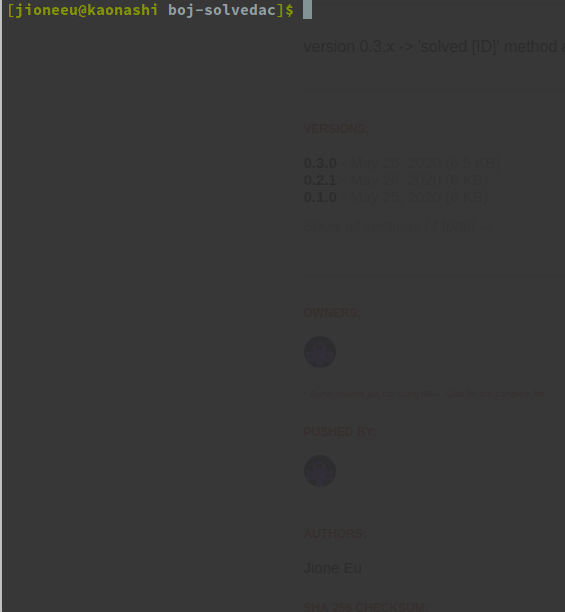

# [boj-solvedac](https://rubygems.org/gems/boj-solvedac)

[](https://badge.fury.io/rb/boj-solvedac)
[](#) 
[](https://hits.seeyoufarm.com)

Baekjoon Online Judge [Solved.ac](https://solved.ac/) CLI.



## 설치
### Gem
```
$ gem install boj-solvedac
```

### curl
`curl`의 설치가 불가능한 경우, 해당 디렉토리를 클론한 후 `lib/data/stats/`을   
`boj-solvedac`를 실행 할 디렉토리 최상단에 옮겨준다.

**Windows**: 
윈도우에서의 설치는 [여기](http://www.confusedbycode.com/curl/#downloads)를 참조.

**MacOSX**
```sh
$ brew install curl
```

**Arch**:
```sh
$ sudo pacman -S curl
```

**Debian**:
```sh
$ sudo apt install curl
```

## 사용법
### 먼저
프로그램을 시작하기 전, `stats/solved-problems.dat` 파일을 만들고 안에 [BOJ](https://www.acmicpc.net/)에서 
푼 문제들을 복사-붙여넣기 해준다. 그리고 아래의 코드로 실행.

```rb
require 'boj-solvedac'

boj = BOJ::BOJSolvedAC.new
boj.start
```

처음 프로그램을 실행할 경우, `stats/` 디렉토리를 찾는다. 만약 이 디렉토리가 없는 경우 `lib/data/stats/`의 자료를
`curl`을 사용해 가져온다.

### 명령어
- `exit` or `quit`: 프로그램을 종료
- `clear`: 화면을 클리어

prob
- `prob [LEVEL]`: [LEVEL]에 해당하는 문제들을 전부 출력
- `prob solved` : 푼 문제들(`solved-problem.dat`)을 ID순으로 출력

stat
- `stat all`    : 모든 레벨의 unsolved/solved/total 수치를 출력
- `stat [LEVEL]`: [LEVEL]의 unsolved/solved/total 수치를 출력
  + stat bronze5: bronze5 레벨의 수치 출력
  + stat bronze : 모든 bronze 레벨들의 수치를 출력 (bronze5, 4, ..., 1)

solved
- `solved [ID]`: 푼 문제(`solved-problems.dat`) 파일에 [ID]를 추가

random
- `random`        : 풀지 않은 문제를 무작위로 하나 출력
- `random [LEVEL]`: 풀지 않은 [LEVEL]의 문제를 무작위로 하나 출력  
\*random 명령어를 실행한 후, [엔터]키를 누르면 이전 random 명령어가 반복된다.

[LEVEL]에 사용가능한 명령어:
-	unrated
-	bronze[5-1] <--- bronze5, bronze4, ..., bronze1
-	silver[5-1]
-	gold[5-1]
-	platinum[5-1]
-	diamond[5-1]
-	ruby[5-1]

